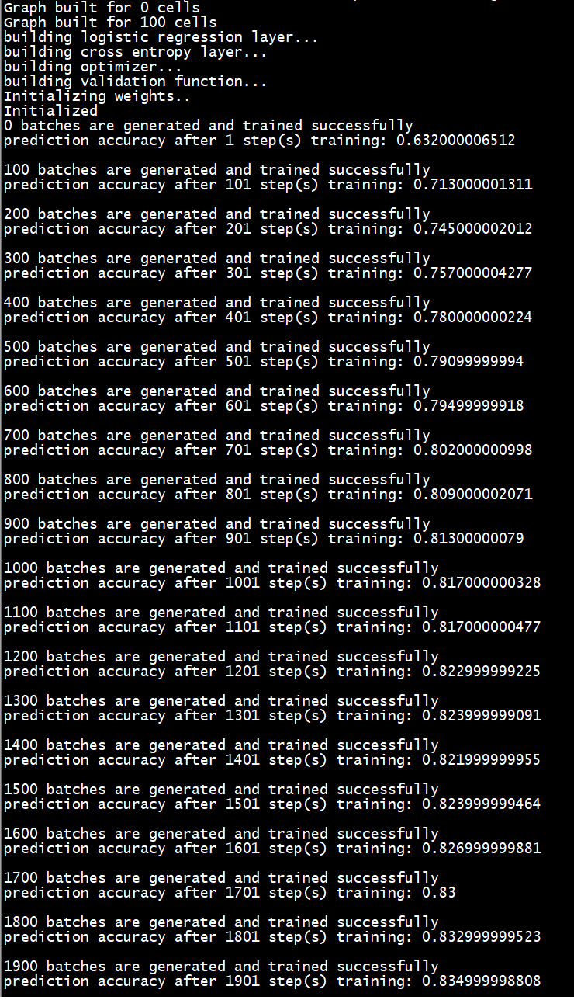

# Voice Gender Recognition
Notic(2017-10-27): This is the very first version of repo. Future work is required to push the prediction performance to higher level. 

### Summary
Inspired by [LSTM Networks for Sentiment Analysis](http://deeplearning.net/tutorial/lstm.html). Here is an implementation repo for training a LSTM neurtal networks for recogonizing audio data's speaker gender. The audio data used is from  [Vox Forge](http://www.repository.voxforge1.org/downloads/SpeechCorpus/Trunk/Audio/Main/16kHz_16bit/). 
Data Science is supposed to handle all kinds of problems without having domain knowledge. We assume no knowledge exist for data scientist in Audio signal processing. 'FFT' is an alternative optioin instead of letting the neural nets learn the audio signal logic from raw wave data them self.

### Scraping down tgz audio file
Run [scrap.py](https://github.com/JinScientist/voice-gender-recognition/blob/master/scrap.py) will download every tgz file and save to local directory ./rawdata.

### Parse the README file in each package
In README file, the 5th line contains the speak gender information of all audio .wav files in the directory. The 'labeling' function in [vocal_gender_lstm.py](https://github.com/JinScientist/voice-gender-recognition/blob/master/vocal_gender_lstm.py) parse the README file and return the data label and wave raw data in the format of numpy array. 

### Neural Nets Graph
Use fixed number of LSTM cells to take input from squential wave raw data. The hidden state of each cells are concated nated to 2-D matrix as output. The output data dimension is reduced by takeing average pooling in large strides. Then the output layer is stardard softmax on pooling results. The cost function is constructed by caculating the cross entroy between data label and softmax output from the networks.

### Mini Batch training
The training process takes each tgz file as one mini batch.All 10 audio files are taken for one epoch of opitimizing process. Every 100 mini batch, the network prediction performance is validated by run 100 out-of-sample validation samples. The classification accuracy is printed by percentage. By using mini batch, the disk space and memory is saved. 

### Performance
| Mini Batches | Accuracy Achieved  |
|--------------|--------------------|
| 1            | 63.20%             |
| 100          | 71.30%             |
| 200          | 74.50%             |
| 300          | 75.70%             |
| 400          | 78.0%              |
| 500          | 79.10%             |
| 600          | 79.50%             |
| 700          | 80.20%             |
| 800          | 80.90%             |
| 900          | 81.30%             |
| 1000         | 81.70%             |
| 1100         | 81.70%             |
| 1200         | 82.30%             |
| 1300         | 82.40%             |
| 1400         | 82.20%             |
| 1500         | 82.40%             |
| 1600         | 82.70%             |
| 1700         | 83.0%              |
| 1800         | 83.30%             |
| 1900         | 83.50%             |



### Requirments
tensorflow, numpy, scipy
### Scripts
The experiment can be reproduced by running following command:
```
mkdir rawdata
python scrap.py
python vocal_gender_lstm.py > ./train_results.txt
```

