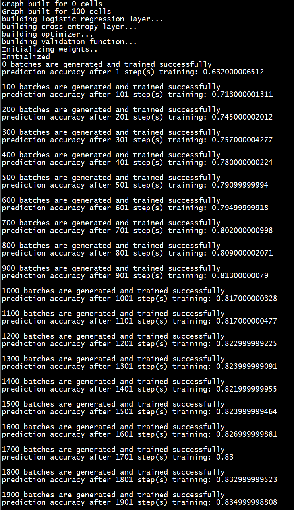

# Voice Gender Recognition

An LSTM-based neural network that classifies speaker gender from raw audio waveform data. Trained on the [VoxForge](http://www.repository.voxforge1.org/downloads/SpeechCorpus/Trunk/Audio/Main/16kHz_16bit/) open speech corpus, achieving **83.5% accuracy** after 1900 training batches.

## Overview

This project takes a domain-knowledge-free approach to audio classification — no FFT or manual feature engineering. The raw waveform is fed directly into an LSTM network, which learns to extract gender-relevant patterns on its own.

## Files

| File | Description |
|------|-------------|
| `scrap.py` | Downloads all `.tgz` audio packages from VoxForge to `./rawdata/` |
| `vocal_gender_lstm.py` | Main training script — builds and trains the LSTM model |
| `train_results.png` | Accuracy curve over training batches |
| `LICENSE` | MIT License |

## Architecture

```
Raw .wav (20,000 samples)
        │
        ▼
  Reshape: [200 batches × 10 files × 100 features]
        │
        ▼
  LSTM cells (hidden size = 2)
        │
        ▼
  Concat hidden states → [10 × 2 × 200] matrix
        │
        ▼
  Average Pooling (large stride)
        │
        ▼
  Softmax → [Male, Female]
```

- **LSTM hidden size**: 2
- **Batch size**: 10 audio files per batch (1 `.tgz` package)
- **Input window**: 20,000 raw samples per file (split into 200 × 100 chunks)
- **Optimizer**: Adam (lr=1e-4)
- **Loss**: Cross-entropy

## Requirements

- Python 2.7
- TensorFlow
- NumPy
- SciPy
- BeautifulSoup (for scraping)

```bash
pip install tensorflow numpy scipy beautifulsoup
```

## Usage

### Step 1 — Download the audio dataset

```bash
mkdir rawdata
python scrap.py
```

> This scrapes ~2000+ `.tgz` files from VoxForge (~several GB). Allow time for download.

### Step 2 — Train the model

```bash
python vocal_gender_lstm.py > ./train_results.txt
```

Validation accuracy is printed every 100 batches.

## Performance

| Mini Batches | Accuracy | Mini Batches | Accuracy |
|-------------|----------|-------------|----------|
| 1           | 63.20%   | 1000        | 81.70%   |
| 100         | 71.30%   | 1100        | 81.70%   |
| 200         | 74.50%   | 1200        | 82.30%   |
| 300         | 75.70%   | 1300        | 82.40%   |
| 400         | 78.00%   | 1400        | 82.20%   |
| 500         | 79.10%   | 1500        | 82.40%   |
| 600         | 79.50%   | 1600        | 82.70%   |
| 700         | 80.20%   | 1700        | 83.00%   |
| 800         | 80.90%   | 1800        | 83.30%   |
| 900         | 81.30%   | 1900        | **83.50%** |



## How Labeling Works

Each `.tgz` package from VoxForge contains:
- Multiple `.wav` audio files of one speaker
- A `README` file whose 5th line contains `Gender: Male` or `Gender: Female`

The `labeling()` function in `vocal_gender_lstm.py` parses this README and returns:
- `[1, 0]` → Male
- `[0, 1]` → Female

## Notes

- Trained and validated on 2000 + 100 `.tgz` files respectively
- Future improvements: larger LSTM, batch normalization, FFT features
